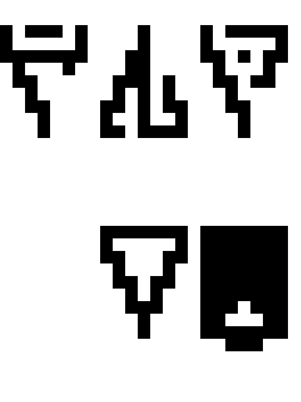
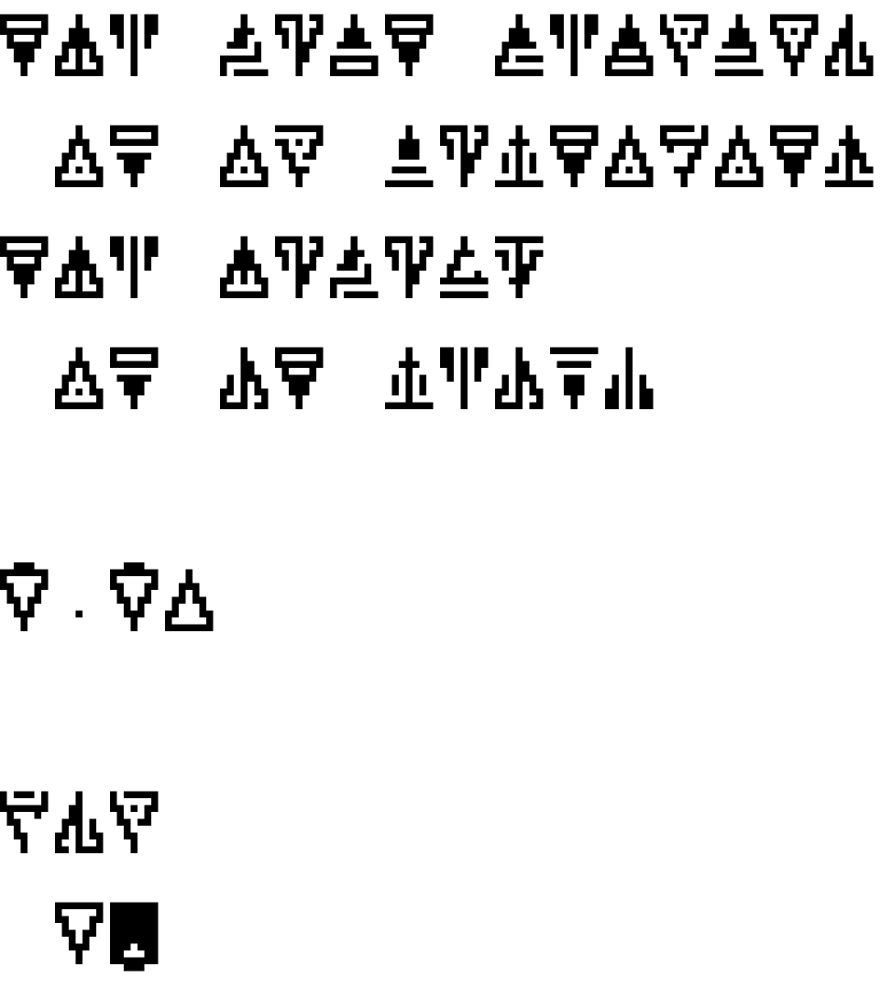

ZDR16 is a monospaced self-flipping font inspired by the IBM console fonts of yesteryear.

An example of text can be seen here:



## Usage

Download the [latest version](https://github.com/raffitz/zdr16/releases/latest) of the font.  For desktop use, you'll want to download the `zdr16.otf` file and install it as a system font.  For use on a website, you'll want `zdr16.woff2`, and the following CSS:

```css
@font-face {
  font-family: 'zdr16regular';
  src: url('./zdr16.woff2') format('woff2');
  font-weight: normal;
  font-style: normal;
}
```

## Building

### Prerequisites

* have python3 and imagemagick installed (commands vary per OS)

### Run builder

This will build the font and generate the title and demo.

```bash
./build.sh
```

